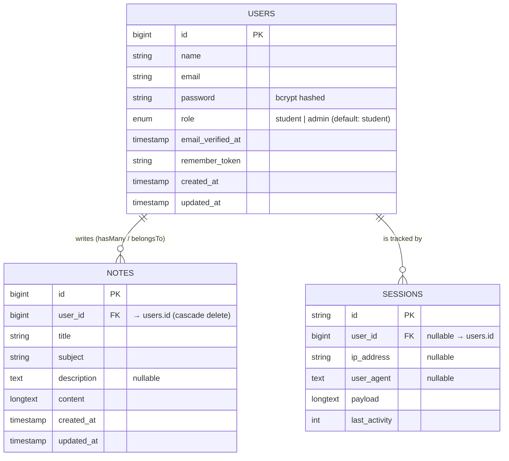

# WAD 2 — Classroom Notes Sharing App

## Teaching Guide: Authentication · Middleware · Authorization · Policy

> **App:** Class Collab — students write and share notes, others can read them.
> **Stack:** Laravel 13 · Blade · Tailwind CSS · SQLite

---

## Table of Contents

1. [ERD — Database Relationships](#1-erd--database-relationships)
2. [Architecture — How a Request Flows](#2-architecture--how-a-request-flows)
3. [Phase 1 — Authentication](#3-phase-1--authentication)
4. [Phase 2 — Middleware](#4-phase-2--middleware)
5. [Phase 3 — Authorization (Gates)](#5-phase-3--authorization-gates)
6. [Phase 4 — Policy](#6-phase-4--policy)
7. [How It All Connects](#7-how-it-all-connects)
8. [Classroom Demo Script](#8-classroom-demo-script)
9. [Seed Accounts](#9-seed-accounts)

---

## 1. ERD — Database Relationships



**Relationships explained:**

| Relationship                     | Direction        | Code                             |
| -------------------------------- | ---------------- | -------------------------------- |
| A user writes many notes         | `User → Note`    | `User::hasMany(Note::class)`     |
| A note belongs to one user       | `Note → User`    | `Note::belongsTo(User::class)`   |
| Laravel tracks sessions per user | `User → Session` | Handled automatically by Laravel |

---

## 2. Architecture — How a Request Flows

```mermaid
flowchart TD
    Browser["🌐 Browser\n(HTTP Request)"]

    Browser --> Router

    subgraph Routes ["routes/web.php + routes/auth.php"]
        Router["Route Matching\nGET /notes/5/edit"]
    end

    Router -->|"Route has middleware('auth')"| AuthMW
    Router -->|"Route has middleware('admin')"| AdminMW
    Router -->|"Public route (no middleware)"| Controller

    subgraph Middleware ["Middleware Pipeline (runs in order)"]
        AuthMW["🔐 auth middleware\n(built-in)\nIs the user logged in?"]
        AdminMW["🛡️ EnsureUserIsAdmin\n(custom)\nIs role = 'admin'?"]
    end

    AuthMW -->|"❌ Not logged in"| RedirectLogin["Redirect → /login"]
    AuthMW -->|"✅ Logged in"| AdminMW
    AuthMW -->|"✅ Logged in (no admin check needed)"| Controller

    AdminMW -->|"❌ Not admin"| Abort403A["abort(403)\nAccess Denied"]
    AdminMW -->|"✅ Is admin"| Controller

    subgraph Controllers ["app/Http/Controllers/NoteController.php"]
        Controller["NoteController\ne.g. edit(Note \$note)"]
    end

    Controller -->"|"\$this->authorize('update', \$note)\nTriggered on edit/delete"| PolicyCheck

    subgraph Authorization ["app/Policies/NotePolicy.php + AppServiceProvider.php"]
        PolicyCheck["Policy / Gate Check"]
        Policy["NotePolicy\nupdate: owner only\ndelete: owner OR admin"]
        Gate["Gate\ndelete-any-note: isAdmin()"]
        PolicyCheck --> Policy
        PolicyCheck --> Gate
    end

    Policy -->|"❌ Not owner"| Abort403B["abort(403)\nForbidden"]
    Gate   -->|"❌ Not admin"| Abort403C["abort(403)\nForbidden"]
    Policy -->|"✅ Authorized"| DB
    Gate   -->|"✅ Authorized"| DB

    subgraph Data ["Database (SQLite)"]
        DB["Eloquent Query\nNote::find() / \$note->update()"]
    end

    DB --> View

    subgraph Views ["resources/views/notes/"]
        View["Blade Template\n@can / @auth directives\nhide or show buttons"]
    end

    View --> Browser
```

**Key insight:** Each layer has one job.

- **Routes** — map URLs to controllers and declare which middleware applies
- **Middleware** — gate-keeps access _before_ the controller runs (is the request even allowed in?)
- **Controller** — handles the business logic and calls `$this->authorize()` for model-level checks
- **Policy** — answers "can this specific user act on this specific record?"
- **View** — uses `@can` to show/hide UI elements to match what the backend enforces

---

## 3. Phase 1 — Authentication

> **Core question for students:** _"How does the app know WHO you are?"_

### What Authentication Does

Authentication is the process of verifying identity. In this app, a user proves who they are by submitting a correct email + password. Laravel then creates a **session** so the user doesn't have to log in on every request.

### Key Files

```
app/Http/Controllers/Auth/AuthenticatedSessionController.php  ← handles login
app/Http/Controllers/Auth/RegisteredUserController.php        ← handles register
routes/auth.php                                               ← login/logout/register routes
```

### The Login Flow (step by step)

```
1. User visits /login
2. Submits email + password via POST form
3. AuthenticatedSessionController calls Auth::attempt(['email' => ..., 'password' => ...])
4. Laravel looks up the user by email in the users table
5. Laravel verifies the password against the stored bcrypt hash using password_verify()
6. If correct → Laravel creates a session, stores user_id in it, sets a cookie
7. Redirects to /dashboard
8. Every future request reads the session cookie → Laravel knows who you are
```

### The User Model

```php
// app/Models/User.php

#[Fillable(['name', 'email', 'password', 'role'])]
#[Hidden(['password', 'remember_token'])]
class User extends Authenticatable
{
    use HasFactory, Notifiable;

    protected function casts(): array
    {
        return [
            'email_verified_at' => 'datetime',
            'password'          => 'hashed',   // ← auto-bcrypt on assignment
        ];
    }

    public function isAdmin(): bool
    {
        return $this->role === 'admin';        // ← used by middleware + policy
    }

    public function notes(): HasMany
    {
        return $this->hasMany(Note::class);    // ← one user → many notes
    }
}
```

> **Note:** `'password' => 'hashed'` means when you do `$user->password = 'secret'`, Laravel automatically bcrypt-hashes it. You never store plain text passwords.

### Accessing the Authenticated User

```php
// In a controller
Auth::user()       // returns the full User model instance
Auth::id()         // returns just the user's ID (integer)
$request->user()   // same as Auth::user(), preferred in controllers

// Check if logged in
Auth::check()      // returns true/false
```

```blade
{{-- In Blade views --}}
@auth
    <p>Hello, {{ Auth::user()->name }}!</p>
@endauth

@guest
    <a href="{{ route('login') }}">Please log in</a>
@endguest
```

### The Registration Migration

```php
// database/migrations/0001_01_01_000000_create_users_table.php
Schema::create('users', function (Blueprint $table) {
    $table->id();
    $table->string('name');
    $table->string('email')->unique();
    $table->timestamp('email_verified_at')->nullable();
    $table->string('password');               // ← stores the bcrypt hash
    $table->enum('role', ['student', 'admin'])->default('student'); // ← added by us
    $table->rememberToken();
    $table->timestamps();
});
```

### Teaching Point

> Authentication is **not** about what you can do — it is purely about proving **who you are**. What you are allowed to do is handled by Authorization (Phases 3 & 4).

---

## 4. Phase 2 — Middleware

> **Core question for students:** _"How does the app stop you from even reaching a page you're not supposed to see?"_

### What Middleware Does

Middleware is code that runs **between** the incoming HTTP request and the controller. Think of it as a security checkpoint at the door — if you don't pass the check, you never get in.

```
Request → [Middleware 1] → [Middleware 2] → Controller → Response
                ↓                  ↓
            /login              abort(403)
         (if not logged in)   (if not admin)
```

### Two Middleware Layers in This App

#### Layer 1 — Built-in `auth` (checks: is user logged in?)

**File:** `routes/web.php`

```php
Route::middleware('auth')->group(function () {
    Route::resource('notes', NoteController::class);
});
```

If a guest visits `/notes/create`, the `auth` middleware redirects them to `/login` **before the controller runs**. The controller code never executes.

#### Layer 2 — Custom `EnsureUserIsAdmin` (checks: is role = admin?)

**File:** `app/Http/Middleware/EnsureUserIsAdmin.php`

```php
class EnsureUserIsAdmin
{
    public function handle(Request $request, Closure $next): Response
    {
        if (! $request->user() || ! $request->user()->isAdmin()) {
            abort(403, 'Access denied. Admins only.');
        }

        return $next($request);  // ← passes the request to the next layer
    }
}
```

> **Explain `$next($request)`:** This is what "passes" the request forward in the pipeline. If you don't call it, the request stops here and the controller is never reached.

**Registered as an alias** in `bootstrap/app.php` (Laravel 13 style — no `Kernel.php`):

```php
->withMiddleware(function (Middleware $middleware): void {
    $middleware->alias([
        'admin' => EnsureUserIsAdmin::class,
    ]);
})
```

**Used on a route:**

```php
// Example: only admins can view a user management page
Route::middleware(['auth', 'admin'])->group(function () {
    Route::get('/admin/users', [AdminController::class, 'index']);
});
```

### Middleware vs Authorization — Know the Difference

|                    | Middleware                                  | Authorization (Gate/Policy)                  |
| ------------------ | ------------------------------------------- | -------------------------------------------- |
| **When it runs**   | Before the controller                       | Inside the controller                        |
| **What it checks** | Broad access rules (logged in? admin role?) | Specific model-level rules (owns this note?) |
| **On failure**     | Redirect or abort(403)                      | Always abort(403)                            |
| **Example**        | "Only logged-in users can access /notes"    | "Only the owner can edit this note"          |

### Teaching Point

> Middleware is a **pipeline**. Every request passes through registered middleware in order. The `$next($request)` call is what continues the chain. Not calling it is how you block the request.

---

## 5. Phase 3 — Authorization (Gates)

> **Core question for students:** _"The user is logged in — but are they ALLOWED to perform this action?"_

### What a Gate Is

A Gate is a **closure** (anonymous function) that returns `true` or `false` to answer a simple authorization question. Gates are best for checks that are **not tied to a specific model**.

### Defining a Gate

**File:** `app/Providers/AppServiceProvider.php`

```php
use Illuminate\Support\Facades\Gate;

public function boot(): void
{
    // Gate: "Can this user delete any note?" → only admins
    Gate::define('delete-any-note', fn(User $user) => $user->isAdmin());

    // Policy registration (covered in Phase 4)
    Gate::policy(Note::class, NotePolicy::class);
}
```

> Laravel **automatically injects the authenticated user** as the first argument. You never pass it manually.

### Using a Gate in a Controller

```php
use Illuminate\Support\Facades\Gate;

// Option A: manually check and handle it yourself
if (Gate::denies('delete-any-note')) {
    abort(403);
}

// Option B: let Laravel throw the 403 automatically (preferred)
Gate::authorize('delete-any-note');
```

### Using a Gate in a Blade View

```blade
@can('delete-any-note')
    {{-- This button only renders for admins --}}
    <button class="text-red-600">Delete Any Note</button>
@endcan

@cannot('delete-any-note')
    <p>You don't have permission to do this.</p>
@endcannot
```

### Gate vs Policy — When to Use Which

| Use a **Gate** when…                 | Use a **Policy** when…                              |
| ------------------------------------ | --------------------------------------------------- |
| The check is simple, one-off         | The check is tied to a model (Note, Post, etc.)     |
| It doesn't involve a specific record | Different actions need different rules per record   |
| Example: "is this user an admin?"    | Example: "can this user edit _this specific_ note?" |

### Teaching Point

> Gates answer the question **"Can you do X?"** (no model context).
> Policies answer **"Can you do X to this specific Y?"** (with model context).

---

## 6. Phase 4 — Policy

> **Core question for students:** _"How do we make sure students can only edit and delete their OWN notes — not anyone else's?"_

### What a Policy Is

A Policy is a **class** that groups authorization logic for a single model. Each method in the policy corresponds to an action (view, create, update, delete, etc.).

### The NotePolicy

**File:** `app/Policies/NotePolicy.php`

```php
class NotePolicy
{
    // Any logged-in user can list notes
    public function viewAny(User $user): bool
    {
        return true;
    }

    // Any logged-in user can view a single note
    public function view(User $user, Note $note): bool
    {
        return true;
    }

    // Any logged-in user can create a note
    public function create(User $user): bool
    {
        return true;
    }

    // Only the OWNER can edit their note
    public function update(User $user, Note $note): bool
    {
        return $user->id === $note->user_id;
    }

    // Owner OR admin can delete a note
    public function delete(User $user, Note $note): bool
    {
        return $user->id === $note->user_id || $user->isAdmin();
    }
}
```

> **Key line:** `$user->id === $note->user_id` — this is the ownership check. Laravel passes both the logged-in user AND the specific Note model being acted on.

### Registering the Policy

**File:** `app/Providers/AppServiceProvider.php`

```php
Gate::policy(Note::class, NotePolicy::class);
```

This tells Laravel: _"Whenever someone tries to authorize an action on a `Note` model, use `NotePolicy` to decide."_

> In Laravel 13, policies can also be **auto-discovered** by naming convention — `NotePolicy` for `Note` model. The explicit registration above makes it clear for teaching purposes.

### Using a Policy in a Controller

**File:** `app/Http/Controllers/NoteController.php`

```php
public function edit(Note $note): View
{
    $this->authorize('update', $note);  // ← calls NotePolicy::update($user, $note)
    return view('notes.edit', compact('note'));
}

public function update(Request $request, Note $note): RedirectResponse
{
    $this->authorize('update', $note);  // ← checked again on form submission
    // ... validation and update logic
}

public function destroy(Note $note): RedirectResponse
{
    $this->authorize('delete', $note);  // ← calls NotePolicy::delete($user, $note)
    $note->delete();
    return redirect()->route('notes.index')->with('success', 'Note deleted.');
}
```

> **Important:** `$this->authorize()` works because `Controller` uses the `AuthorizesRequests` trait:
>
> ```php
> // app/Http/Controllers/Controller.php
> use Illuminate\Foundation\Auth\Access\AuthorizesRequests;
> abstract class Controller {
>     use AuthorizesRequests;
> }
> ```

### Using a Policy in Blade Views

The `@can` directive automatically uses the policy when you pass a model instance.

**File:** `resources/views/notes/index.blade.php`

```blade
@foreach ($notes as $note)
    <a href="{{ route('notes.show', $note) }}">{{ $note->title }}</a>

    {{-- Only shows for the note's owner --}}
    @can('update', $note)
        <a href="{{ route('notes.edit', $note) }}">Edit</a>
    @endcan

    {{-- Shows for the note's owner AND for admins --}}
    @can('delete', $note)
        <form action="{{ route('notes.destroy', $note) }}" method="POST">
            @csrf @method('DELETE')
            <button type="submit">Delete</button>
        </form>
    @endcan
@endforeach
```

### Teaching Point

> `@can` in Blade only **hides the button** — the policy check in the controller is what **actually enforces** the rule. Always authorize in both places:
>
> - **Blade** → hides the button from unauthorized users (UX)
> - **Controller** → throws 403 even if someone manually types the URL (security)

---

## 7. How It All Connects

Here is a concrete example tracing a student trying to edit another student's note:

```
1. Alice (student) is logged in.
2. Alice manually types: GET /notes/3/edit  (Note 3 belongs to Bob)

3. routes/web.php matches the route:
   Route::resource('notes', NoteController::class)
   → wrapped in middleware('auth')

4. auth middleware runs:
   → Alice IS logged in ✅ → pass forward

5. NoteController@edit runs:
   public function edit(Note $note): View
   {
       $this->authorize('update', $note);   ← THIS LINE RUNS
       ...
   }

6. $this->authorize('update', $note) triggers NotePolicy::update()
   public function update(User $user, Note $note): bool
   {
       return $user->id === $note->user_id;
       // Alice's ID (1) === Bob's note user_id (2)?  → FALSE
   }

7. Policy returns false → Laravel throws AuthorizationException
8. Laravel renders a 403 Forbidden page.
9. Alice cannot edit Bob's note. ✅
```

---

## 8. Classroom Demo Script

Run these in sequence during class — each step shows one concept in isolation.

### Step 1 — Authentication

```bash
# Start the server
php artisan serve
```

1. Visit `http://127.0.0.1:8000/notes` while **not logged in**
2. Show the redirect to `/login` → _"This is the `auth` middleware in action"_
3. Log in as `alice@example.com` / `password`
4. Open Tinker: `php artisan tinker`
    ```php
    Auth::user()    // null (Tinker has no session)
    User::first()   // show the model structure
    ```

### Step 2 — Middleware

1. Open `routes/web.php` — show the `middleware('auth')` group wrapping the note routes
2. Open `app/Http/Middleware/EnsureUserIsAdmin.php` — walk through the `handle()` method
3. Open `bootstrap/app.php` — show where `'admin'` alias is registered
4. Log out, visit `/notes/create` → show the redirect
5. Log in, visit `/notes/create` → it works

### Step 3 — Authorization (Gate)

1. Open `app/Providers/AppServiceProvider.php`
2. Show `Gate::define('delete-any-note', ...)` and explain the closure
3. Log in as `alice@example.com` — find a note she doesn't own → no "Delete" button
4. Log in as `admin@example.com` — all notes show a "Delete" button
5. Show in the Blade view: `@can('delete', $note)` → explain it uses the Policy (next)

### Step 4 — Policy

1. Open `app/Policies/NotePolicy.php`
2. Show `update()` — `$user->id === $note->user_id`
3. Show `delete()` — owner **OR** admin
4. Log in as `alice@example.com`, find a note by Bob
5. Manually visit `/notes/{bob_note_id}/edit` → show the 403
6. **Live edit:** Change `update()` to `return true;` → refresh → Alice can now edit Bob's note
7. **Revert** → explain why this is dangerous

### Step 5 — Connecting the Dots

Draw this on the board:

```
WHO ARE YOU?     CAN YOU ACCESS THIS PAGE?     CAN YOU DO THIS TO THIS RECORD?
Authentication  →  Middleware               →  Policy
(Login/Session)    (auth, admin guards)        (NotePolicy: owner check)
```

---

## 9. Seed Accounts

Run `php artisan db:seed` to populate the database with these test accounts.

| Name          | Email               | Password   | Role    |
| ------------- | ------------------- | ---------- | ------- |
| Admin User    | `admin@example.com` | `password` | admin   |
| Alice Student | `alice@example.com` | `password` | student |
| Bob Student   | `bob@example.com`   | `password` | student |

**Seeded notes:**

| Title                   | Subject          | Owner |
| ----------------------- | ---------------- | ----- |
| Calculus Cheat Sheet    | Mathematics      | Alice |
| Newton's Laws Summary   | Physics          | Alice |
| World War II Timeline   | History          | Bob   |
| OOP Concepts Overview   | Computer Science | Bob   |
| Trigonometry Identities | Mathematics      | Admin |

**To reset and re-seed:**

```bash
php artisan migrate:fresh --seed
```
